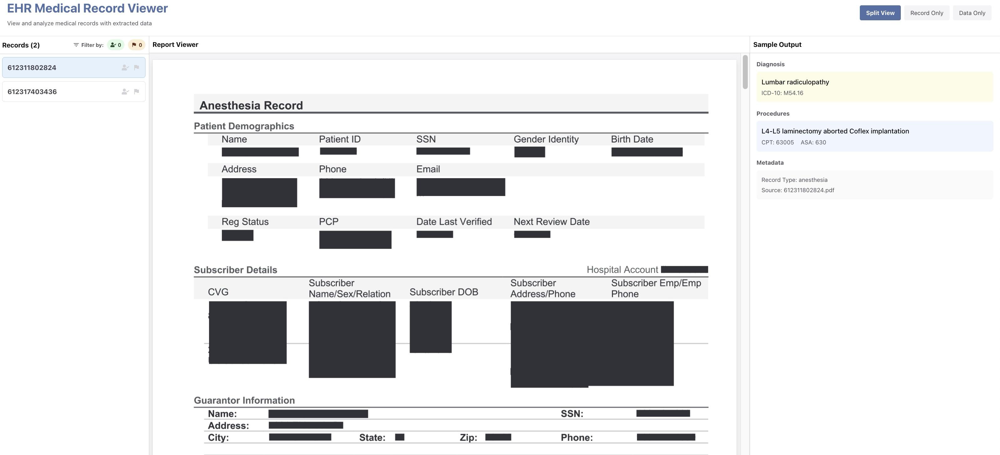

# EHR Medical Record Viewer

A React app for viewing and analyzing medical records with extracted data.



## How to Run

```bash
git clone https://github.com/anmolvj/medical-record-viewer.git
cd medical-record-viewer
npm install
npm run dev
```

App runs at `http://localhost:3000`

## Key Decisions

- **Vite + React + TypeScript** - Fast dev experience with type safety
- **Chakra UI** - Minimal styling with consistent components
- **Context for selection only** - Shared `selectedRecord` state via `SelectionContext`
- **Custom hooks for data** - `useMedicalRecords` (file loading) + `useRecordsManager` (filtering/state)
- **react-pdf** - Native PDF rendering in the browser
- **File discovery via import.meta.glob** - Auto-discovers PDFs/JSONs from `/data` folder at build time
- **Centralized types** - All types in `types/index.ts` using `type` keyword

## Architecture

```
src/
├── components/     # UI components with barrel export (index.ts)
│   ├── Header      # App header with view toggle
│   ├── Body        # Main content layout
│   ├── Panel       # Reusable panel wrapper
│   ├── Files       # Record list with filters
│   ├── Report      # PDF viewer
│   └── Output      # JSON data display
├── context/        # SelectionContext (selectedRecord state)
├── hooks/          # useMedicalRecords, useRecordsManager
├── types/          # All TypeScript types
└── App.tsx         # Layout and view state
```

## Known Limitations

- Records state (reviewed/flagged) is not persisted - resets on page refresh
- PDF/JSON files must be placed in `/data/ehr_pdfs` and `/data/json_outputs` before build
- No search or sorting functionality for records list
- JSON output display assumes specific schema structure